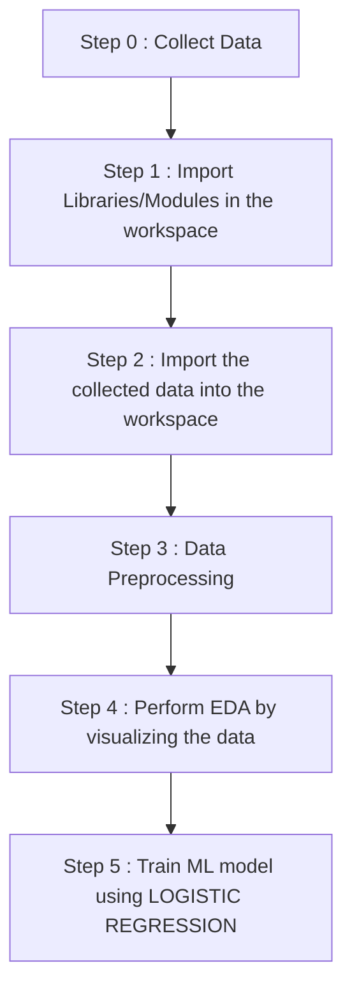

# Breast-Cancer-Classifier
This is a Breast Cancer Classifier using Machine Learning.

### There are two types of tumours detected in human body : 

<h2>BENIGN TUMOUR</h2>
<ul>
  <li>  Non - Cancerous
  <li>  Capsulated
  <li>  Non - invasive
  <li>  Slow growing
  <li>  Do not spread to other parts of the body
  <li>  Cells are normal
</ul>

 

<h2>MALIGNANT TUMOUR</h2>
<ul>
  <li> Cancerous
  <li> Capsulated
  <li> Non - invasive
  <li> Slow growing
  <li> Do not spread to other parts of the body
  <li> Cells are normal
</ul>

<h2 align="center">WORKFLOW OF THE PROJECT </h2>

